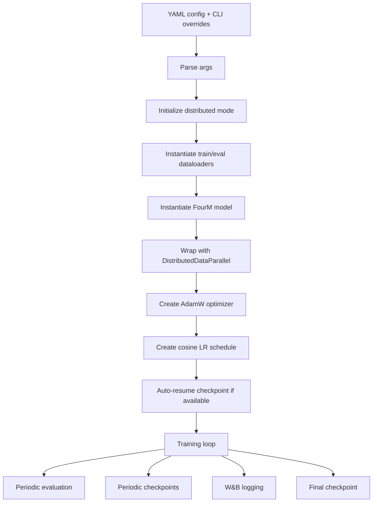

# IA Extension Project: Masking Strategies for nano4M

This document explains the project from A to Z. It is written as a complete technical guide for someone who receives the repository and needs to understand what it contains, what was implemented, how the training pipeline works, how the results were produced, and what the important caveats are.

Generated from the local repository state on 2026-05-30.

## Table of Contents

1. [Project in One Paragraph](#project-in-one-paragraph)
2. [Repository Scope](#repository-scope)
3. [High-Level Goal](#high-level-goal)
4. [Course Context](#course-context)
5. [Core Research Question](#core-research-question)
6. [Important Paths](#important-paths)
7. [Conceptual Background](#conceptual-background)
8. [Dataset](#dataset)
9. [Modalities](#modalities)
10. [Model Architecture](#model-architecture)
11. [Masking Pipeline](#masking-pipeline)
12. [Masking Strategies](#masking-strategies)
13. [Implementation Details](#implementation-details)
14. [Configuration Files](#configuration-files)
15. [Training Pipeline](#training-pipeline)
16. [Checkpoints and Outputs](#checkpoints-and-outputs)
17. [Evaluation Pipeline](#evaluation-pipeline)
18. [Existing Local Results](#existing-local-results)
19. [Tests and Sanity Checks](#tests-and-sanity-checks)
20. [How to Reproduce the Work](#how-to-reproduce-the-work)
21. [Known Caveats](#known-caveats)
22. [File-by-File Reference](#file-by-file-reference)
23. [Glossary](#glossary)

## Project in One Paragraph

This repository extends the COM-304 `nano4M` multimodal foundation model exercise by adding and comparing alternative token masking strategies. The original `nano4M` baseline uses random masking over multimodal tokens. This extension introduces structured masking: contiguous span masking for text-like modalities such as `scene_desc`, rectangular block masking for image-token modalities such as `tok_rgb@256`, `tok_depth@256`, and `tok_normal@256`, and mixed strategies that combine structured and random masking. The project trains and compares several variants, tracks losses with Weights & Biases, stores checkpoints, generates scene-description predictions, scores text outputs, and includes tools for text-to-image CLEVR fidelity evaluation.

## Repository Scope

The repository root is:

```text
IA_Extension_Project_Masking-Strategies/
```

It contains a course project folder:

```text
com-304-FM-project-2026-main/
```

Most course material is kept intact. The central extension work is inside:

```text
com-304-FM-project-2026-main/nano4M/
```

The repository contains three broad categories of material:

| Category | Purpose | Main location |
| --- | --- | --- |
| Course scaffolding | Provided notebooks, tutorials, templates, cluster instructions | `PyTorch_Tutorial/`, `4M_Tutorial/`, `SCITAS_Tutorial/`, `gnoto_Tutorial/`, `Templates/`, `nanoVLM/` |
| nano4M implementation | Minimal 4M-like multimodal model, data loading, training, evaluation | `nano4M/nanofm/`, `nano4M/run_training.py`, `nano4M/cfgs/` |
| Extension artifacts | Masking strategies, experiments, checkpoints, plots, scoring scripts | `nano4M/nanofm/data/multimodal/masking.py`, `nano4M/outputs/`, `nano4M/wandb/`, `nano4M/*evaluation*.md` |

The short root `README.md` already states the extension theme:

- span masking for sequence/text modalities;
- block masking for image-token modalities;
- optional random/structured mixing through `structured_mask_probability`.

This document expands that into a full project guide.

## High-Level Goal

The goal is to test whether the way tokens are hidden during training changes how well a multimodal model learns cross-modal structure.

The baseline randomly selects target tokens. This is simple, but it ignores the structure of each modality:

- text is sequential, so nearby tokens often form meaningful phrases;
- image tokens are spatial, so nearby tokens correspond to nearby image regions;
- multimodal learning depends on predicting missing information from other modalities.

The extension asks:

> If we mask text in contiguous spans and images in spatial blocks, does `nano4M` learn better or differently than with fully random masking?

The project compares variants under the same core architecture and training setup, changing mainly the target-token selection policy.

## Course Context

This repository comes from the COM-304 Intelligent Systems: Communications & AI foundation models track.

The course material introduces:

- PyTorch fundamentals;
- cluster usage on SCITAS/Kuma and gnoto;
- GPT-style autoregressive modeling;
- MaskGIT-style masked generative modeling;
- 4M, short for Massively Multimodal Masked Modeling;
- Flow Matching;
- Vision-Language Models.

The main exercise relevant to this project is `nano4M`, a minimal implementation of a 4M-style multimodal model.

The provided project template asks students to choose an extension category. This repository corresponds to the category:

```text
alternate masking strategies
```

The extension is not a new model architecture. It is primarily a change to the data masking process used to create encoder inputs and decoder targets.

## Core Research Question

The project compares masking strategies while keeping the rest of the system mostly constant.

Controlled elements:

- model family: `FourM`;
- model size: depth 6 encoder, depth 6 decoder, width 512;
- dataset: MultiCLEVR / CLEVR token dataset;
- modalities: RGB tokens, depth tokens, normal tokens, scene description text;
- training token budget: 5000M tokens;
- optimizer and learning rate schedule;
- batch size and dtype in the main runs;
- validation and checkpointing cadence.

Variable element:

- which token positions become decoder targets.

The expected analysis is therefore not "which architecture wins", but:

- does span masking help text prediction?
- does block masking help image-token prediction?
- does combining both help or hurt?
- does mixed random/structured masking stabilize training?
- do loss curves, validation losses, and generation metrics tell the same story?

## Important Paths

Top-level project files:

```text
README.md
PROJECT_DOCUMENTATION.md
com-304-FM-project-2026-main/
```

Main extension files:

```text
com-304-FM-project-2026-main/nano4M/nanofm/data/multimodal/masking.py
com-304-FM-project-2026-main/nano4M/nanofm/data/multimodal/__init__.py
com-304-FM-project-2026-main/nano4M/nanofm/data/multimodal/simple_multimodal_dataset.py
```

Main model files:

```text
com-304-FM-project-2026-main/nano4M/nanofm/models/fourm.py
com-304-FM-project-2026-main/nano4M/nanofm/modeling/transformer_layers.py
```

Training files:

```text
com-304-FM-project-2026-main/nano4M/run_training.py
com-304-FM-project-2026-main/nano4M/submit_job.sh
com-304-FM-project-2026-main/nano4M/cfgs/nano4M/
```

Evaluation files:

```text
com-304-FM-project-2026-main/nano4M/eval_only.py
com-304-FM-project-2026-main/nano4M/eval_checkpoints.py
com-304-FM-project-2026-main/nano4M/generate_scene_desc_predictions.py
com-304-FM-project-2026-main/nano4M/score_scene_desc_predictions.py
com-304-FM-project-2026-main/nano4M/compare_one_sample_all_models.py
com-304-FM-project-2026-main/nano4M/render_scene_desc_to_png.py
com-304-FM-project-2026-main/nano4M/scripts/eval_clevr_fidelity.py
```

Tests:

```text
com-304-FM-project-2026-main/nano4M/tests/test_structured_masking.py
com-304-FM-project-2026-main/nano4M/tests/test_visual_masking.py
com-304-FM-project-2026-main/nano4M/tests/test_clevr_verifier.py
```

Experiment artifacts:

```text
com-304-FM-project-2026-main/nano4M/outputs/
com-304-FM-project-2026-main/nano4M/wandb/
com-304-FM-project-2026-main/nano4M/training_loss_5_models.png
com-304-FM-project-2026-main/nano4M/training_loss_5_models.pdf
```

## Conceptual Background

### 4M and nano4M

4M stands for Massively Multimodal Masked Modeling. The idea is to train one model on multiple aligned modalities and ask it to reconstruct missing tokens from visible tokens. For one scene, the model may receive some image tokens and some text tokens, then predict other image or text tokens.

`nano4M` is a small educational implementation of that idea.

The basic training loop is:

1. Load aligned modalities for one sample.
2. Tokenize each modality.
3. Select visible encoder tokens.
4. Select hidden decoder target tokens.
5. Run the encoder on visible tokens.
6. Run the decoder on target positions and modalities.
7. Compute cross-entropy loss against the hidden target tokens.

### Masked Multimodal Modeling

The model is not trained to predict one fixed output type only. It can learn many conditional directions:

- image tokens from text;
- text from image tokens;
- depth from RGB;
- RGB from depth and normals;
- any mixture of modalities from any other mixture.

This is why the masking strategy matters. The masking policy determines what prediction problems the model sees during training.

### Random vs Structured Masking

Random masking treats each token position independently. It gives broad coverage, but it may create unrealistic prediction tasks:

- random text masking can reveal enough neighboring words to make prediction too easy;
- random image-token masking can scatter targets across the whole grid and ignore spatial locality.

Structured masking tries to create harder and more meaningful prediction tasks:

- span masking hides contiguous text segments;
- block masking hides spatially contiguous image-token regions.

## Dataset

The main dataset is expected at:

```text
/work/com-304/datasets/clevr_com_304/
```

The expected structure is:

```text
clevr_com_304/
  train/
    tok_rgb@256/
    tok_depth@256/
    tok_normal@256/
    scene_desc/
  val/
    tok_rgb@256/
    tok_depth@256/
    tok_normal@256/
    scene_desc/
```

Each modality folder should contain aligned filenames. If the RGB-token folder contains `sample_0001.npy`, the other modalities should contain files with the same stem.

The loader assumes:

- tokenized visual modalities are stored as `.npy`;
- scene descriptions are stored as `.json`;
- each sample may contain multiple augmentations;
- the same augmentation index is used across modalities for a given sample.

### Augmentations

The config uses:

```yaml
sample_from_k_augmentations: 10
```

For each dataset item, the loader samples an augmentation index:

```python
augmentation_idx = np.random.randint(0, self.sample_from_k_augmentations)
```

Then it selects that augmentation for every modality.

### Text Tokenization

`scene_desc` is tokenized with a Hugging Face tokenizer, usually:

```yaml
text_tokenizer_path: gpt2
text_max_length: 256
```

The dataset code adds:

- `[PAD]`;
- `[SOS]`;
- `[EOS]`.

It also uses a post-processor so each text sample becomes:

```text
[SOS] text [EOS]
```

The text sequence is padded or truncated to length 256.

## Modalities

The project uses four modalities:

| Modality | Type | Shape / length | Meaning |
| --- | --- | ---: | --- |
| `tok_rgb@256` | image tokens | 256 tokens | RGB visual scene tokens |
| `tok_depth@256` | image tokens | 256 tokens | depth-map tokens |
| `tok_normal@256` | image tokens | 256 tokens | surface-normal tokens |
| `scene_desc` | text tokens | 256 tokens | structured CLEVR scene description |

Image-token modalities are treated as 16 x 16 token grids:

```yaml
image_token_grid_sizes:
  tok_rgb@256: [16, 16]
  tok_depth@256: [16, 16]
  tok_normal@256: [16, 16]
```

Text is treated as a one-dimensional sequence.

The vocabulary sizes in the configs are:

```yaml
vocab_sizes: [64000, 64000, 64000, 50304]
```

That means:

- image modalities use vocab size 64000;
- `scene_desc` uses vocab size 50304;
- the model uses a unified maximum vocabulary size internally.

## Model Architecture

The main model is:

```python
nanofm.models.fourm.FourM
```

It is defined in:

```text
com-304-FM-project-2026-main/nano4M/nanofm/models/fourm.py
```

The default nano4M config uses:

| Component | Value |
| --- | ---: |
| model dimension | 512 |
| encoder depth | 6 |
| decoder depth | 6 |
| attention head dimension | 64 |
| MLP ratio | 4.0 by default |
| modalities | 4 |
| max sequence length per modality | 256 |
| per-modality loss averaging | enabled |

### Encoder Inputs

The encoder receives:

```text
enc_tokens
enc_positions
enc_modalities
enc_pad_mask
```

Each encoder token embedding is the sum of:

1. token embedding;
2. modality embedding;
3. positional embedding.

Positional embeddings are fixed 1D sine-cosine embeddings.

### Decoder Inputs

The decoder receives target positions and target modality IDs:

```text
dec_positions
dec_modalities
dec_pad_mask
```

The decoder does not receive the ground-truth target tokens as input. It receives "what to predict": target modality and position.

Decoder embeddings are the sum of:

1. decoder modality embedding;
2. positional embedding.

The decoder attends to encoder context through cross-attention.

### Transformer Blocks

The Transformer implementation is in:

```text
nanofm/modeling/transformer_layers.py
```

It includes:

- `LayerNorm`;
- `Mlp`;
- `Attention`;
- `CrossAttention`;
- `Block`;
- `DecoderBlock`;
- `TransformerTrunk`;
- `TransformerDecoderTrunk`.

The encoder is a stack of self-attention blocks.

The decoder is a stack of blocks with:

1. decoder self-attention;
2. cross-attention into encoder context;
3. MLP.

### Output Head and Loss

The decoder output is projected with:

```python
self.to_logits = nn.Linear(dim, self.vocab_size, bias=False)
```

The target loss is cross-entropy with padding ignored:

```python
padding_idx = -100
```

With `per_modality_loss_avg: True`, the model computes one loss per modality and averages modality losses. This avoids a modality with many target tokens dominating the scalar loss.

Metrics returned during training include:

- global `loss`;
- `tok_rgb@256`;
- `tok_depth@256`;
- `tok_normal@256`;
- `scene_desc`.

### ROAR Generation

`FourM.generate_one_modality_roar` implements iterative random-order autoregressive generation.

ROAR means:

```text
Random Order Auto Regressive
```

For a target modality:

1. create all target positions;
2. randomly shuffle those positions;
3. split them into a fixed number of unmasking steps;
4. predict a chunk of positions;
5. append predicted tokens to the encoder context;
6. continue until all target positions are generated;
7. sort tokens back by position.

This is used for:

- generating `scene_desc` from visual modalities;
- generating image tokens from text in the text-to-image evaluation.

## Masking Pipeline

The extension is implemented in:

```text
nanofm/data/multimodal/masking.py
```

The main class is:

```python
SimpleMultimodalMasking
```

The masking object receives a raw multimodal sample:

```python
{
  "tok_rgb@256": tensor([...]),
  "tok_depth@256": tensor([...]),
  "tok_normal@256": tensor([...]),
  "scene_desc": tensor([...])
}
```

It returns the batch-ready masked dictionary:

```python
{
  "enc_tokens": ...,
  "enc_positions": ...,
  "enc_modalities": ...,
  "enc_pad_mask": ...,
  "dec_tokens": ...,
  "dec_positions": ...,
  "dec_modalities": ...,
  "dec_pad_mask": ...
}
```

### Full Masking Sequence

For each sample:

1. Draw the number of encoder input tokens from `input_tokens_range`.
2. Draw the number of decoder target tokens from `target_tokens_range`.
3. Split the input-token budget across modalities with a Dirichlet distribution.
4. Split the target-token budget across modalities with a Dirichlet distribution.
5. For each modality, sample decoder target positions according to the selected masking strategy.
6. Sample encoder input positions from the remaining positions.
7. Gather encoder input tokens and decoder target tokens.
8. Optionally apply sentinel tokens for text span masking.
9. Add modality IDs and positions.
10. Concatenate all modalities.
11. Pad encoder and decoder sequences to fixed lengths.
12. Build boolean padding masks.

### Critical Property

The implementation samples target positions first, then samples input positions while excluding target positions.

That means:

```text
encoder visible positions and decoder target positions are disjoint
```

This is important because otherwise the model could see the answer in the encoder.

## Masking Strategies

The project supports several strategy names and aliases.

| Experiment | Code name | Text masking | Image-token masking |
| --- | --- | --- | --- |
| Baseline | `random`, `model_v0` | random | random |
| V1 | `model_v1`, or config `span` | span | random |
| V2 | `model_v2` | random | block |
| V3 | `model_v3`, or config `structured` | span | block |
| V4 | `model_v4` | 50% span, 50% random | 50% block, 50% random |

The code also normalizes aliases such as:

```text
v1, modelv1, modele_v1, modelev1
```

into:

```text
model_v1
```

### Random Masking

Function:

```python
sample_random_positions
```

It samples positions uniformly at random from available positions.

It can exclude positions already used as decoder targets.

This is the baseline and the fallback for unsupported structured cases.

### Span Masking

Function:

```python
sample_span_positions
```

Span masking selects non-overlapping contiguous text spans.

The span length is sampled with a geometric process controlled by:

```yaml
span_geometric_p: 0.2
```

With `p = 0.2`, the mean span length is roughly 5 tokens.

This is designed for sequence modalities:

```yaml
sequence_modalities: ["scene_desc"]
```

Why it matters:

- it forces the model to reconstruct missing phrases;
- it prevents the model from relying only on adjacent visible tokens;
- it better resembles masked language modeling setups like T5-style span corruption.

### Block Masking

Function:

```python
sample_block_positions
```

Block masking selects rectangular regions on an image-token grid.

For the CLEVR image tokens:

```text
256 tokens = 16 x 16 grid
```

The config uses:

```yaml
block_min_size: 1
block_max_fraction: 0.5
```

The implementation repeatedly samples rectangles until the requested target-token budget is reached. If it cannot fill exactly with blocks after a bounded number of attempts, it fills the missing positions randomly.

Why it matters:

- adjacent image tokens often describe adjacent visual regions;
- block masking makes the model infer missing spatial regions;
- it is closer to inpainting-style prediction than random token reconstruction.

### Structured Masking

The name:

```yaml
masking_strategy: structured
```

means:

- span masking for sequence modalities;
- block masking for image modalities;
- random fallback for other modalities.

For this project, `structured` is essentially V3:

```text
text span + image block
```

### Mixed Masking

The class supports:

```yaml
structured_mask_probability: <float in [0, 1]>
```

When this probability is below 1, structured masking is mixed with random masking.

For example:

```yaml
structured_mask_probability: 0.5
```

would use structured masking about half the time and random masking about half the time for modalities where structured masking applies.

V4 implements a more explicit per-modality mix:

- sequence modalities: 50% span, 50% random;
- image modalities: 50% block, 50% random.

### Sentinel Tokens

`SimpleMultimodalMasking` contains optional sentinel-token support:

```yaml
use_sentinel_tokens: true
num_sentinel_tokens: 20
```

The idea is:

- identify the starts of masked text spans;
- replace the visible token just before each span with a sentinel token ID;
- sentinel IDs start at `50257`, immediately after the GPT-2 vocabulary.

Important caveat:

The class supports this feature, but `create_multimodal_masked_dataloader` currently does not expose `use_sentinel_tokens` and `num_sentinel_tokens` in its function signature or pass them into `SimpleMultimodalMasking`.

Therefore:

- `masking.py` supports sentinel tokens;
- `cfgs/nano4M/multiclevr_d6-6w512_structured_masking.yaml` includes sentinel options;
- launching that config as-is can fail because Hydra passes unsupported keyword arguments into `create_multimodal_masked_dataloader`.

To use sentinels safely, the dataloader factory should be updated to accept and forward:

```python
use_sentinel_tokens: bool = False
num_sentinel_tokens: int = 20
```

## Implementation Details

### Strategy Normalization

`SimpleMultimodalMasking.normalize_masking_strategy` normalizes spelling variations.

Examples:

```text
v2 -> model_v2
modelv2 -> model_v2
modele_v2 -> model_v2
```

This makes command-line overrides easier and avoids fragile naming.

### Modality Type Detection

The masker determines whether a modality is sequence-like or image-like.

Explicit config has priority:

```yaml
sequence_modalities: ["scene_desc"]
image_modalities: ["tok_rgb@256", "tok_depth@256", "tok_normal@256"]
```

Fallback heuristics:

- sequence if the name contains `scene_desc`, `caption`, or `text`;
- image if the name starts with `tok_` or contains `@256`.

### Grid Size Inference

For block masking, each image modality needs a grid.

The config provides:

```yaml
tok_rgb@256: [16, 16]
tok_depth@256: [16, 16]
tok_normal@256: [16, 16]
```

If no grid is provided, the code tries to infer a square grid by taking `sqrt(num_tokens)`.

If the token count is not square and no grid exists, block masking falls back to random masking.

### Dirichlet Token Budgets

Input and target token counts are split across modalities with Dirichlet distributions.

The config uses:

```yaml
input_alphas: [1.0, 1.0, 1.0, 1.0]
target_alphas: [1.0, 1.0, 1.0, 1.0]
```

This makes the modality allocation random but symmetric.

The max per modality is clamped by:

```yaml
max_seq_lens: [256, 256, 256, 256]
```

### Padding Convention

The model expects fixed-size encoder and decoder tensors.

Input tokens are padded with:

```text
0
```

Decoder target tokens are padded with:

```text
-100
```

`-100` is ignored by PyTorch cross-entropy through `ignore_index`.

Padding masks are boolean:

- `True` means valid token;
- `False` means padding.

### Position Embeddings

The masker can use either shared or shifted position indices:

```yaml
overlap_posembs: True
```

With `True`, all modalities reuse positions `0..255`.

With `False`, positions are shifted by modality so each modality has a separate position range.

The current configs use shared position embeddings.

### Vocabulary Overlap

The config uses:

```yaml
overlap_vocab: True
```

With `True`, token IDs are used directly in the unified model embedding table.

If `False`, `to_unified_multimodal_vocab` shifts token IDs by modality offsets.

## Configuration Files

The main configs are in:

```text
com-304-FM-project-2026-main/nano4M/cfgs/nano4M/
```

### Baseline Config

File:

```text
multiclevr_d6-6w512.yaml
```

Key values:

```yaml
masking_strategy: random
structured_mask_probability: 1.0
batch_size: 256
total_tokens: 5000
warmup_tokens: 500
num_tokens_per_sample: 256
lr: 0.0006
min_lr: 0.000001
weight_decay: 0.05
clip_grad: 1.0
dtype: bf16
eval_freq: 100
save_ckpt_freq: 1000
```

It is designed for 2 L40 GPUs.

### V1 Config

File:

```text
multiclevr_d6-6w512_v1_text_span_image_random.yaml
```

Key difference:

```yaml
run_name: "V1_text:span_image:random"
output_dir: "./outputs/V1_text:span_image:random"
masking_strategy: span
wandb_run_name: "V1_text:span_image:random"
```

In the current implementation:

- `span` applies span masking to `scene_desc`;
- image modalities fall back to random;
- this corresponds to V1.

### Structured Config

File:

```text
multiclevr_d6-6w512_structured_masking.yaml
```

Key difference:

```yaml
masking_strategy: structured
use_sentinel_tokens: true
num_sentinel_tokens: 20
```

Conceptually this means:

- text span masking;
- image block masking;
- sentinel tokens for text spans.

But as noted earlier, the sentinel options are not currently forwarded by the dataloader factory.

### V2, V3, and V4

There are no separate committed YAML files for every variant in the local repo, but the code supports them through CLI overrides:

```text
model_v2
model_v3
model_v4
```

Example:

```bash
OMP_NUM_THREADS=1 torchrun --nproc_per_node=2 run_training.py \
  --config cfgs/nano4M/multiclevr_d6-6w512.yaml \
  --masking_strategy model_v4 \
  --run_name "V4_text:span-random_image:block-random" \
  --output_dir "./outputs/V4_text:span-random_image:block-random" \
  --wandb_run_name "V4_text:span-random_image:block-random"
```

The W&B config for the V4 run confirms that both train and eval dataloaders used:

```yaml
masking_strategy: model_v4
```

even though the base YAML was the baseline config.

## Training Pipeline

The main training script is:

```text
com-304-FM-project-2026-main/nano4M/run_training.py
```

It uses:

- argparse for CLI options;
- YAML configs;
- OmegaConf interpolation;
- Hydra `instantiate` for model and dataloaders;
- PyTorch DistributedDataParallel;
- AdamW optimizer;
- cosine learning-rate schedule;
- optional W&B logging;
- `.pth` and `.safetensors` checkpoint saving.

### Training Flow



### Effective Batch Size

The config batch size is per GPU:

```yaml
batch_size: 256
```

With 2 GPUs:

```text
effective batch size = 256 * 2 = 512
```

The script computes:

```python
num_tokens_per_iter = num_tokens_per_sample * total_batch_size
total_iters = ceil(total_tokens * 1e6 / num_tokens_per_iter)
```

With:

```text
total_tokens = 5000M
num_tokens_per_sample = 256
total_batch_size = 512
```

the total iteration count is about:

```text
38147 iterations
```

With 1 GPU, the effective batch size is 256, so the number of iterations roughly doubles.

### Learning Rate Schedule

The scheduler is cosine with warmup:

```yaml
lr: 0.0006
min_lr: 0.000001
warmup_tokens: 500
total_tokens: 5000
```

The warmup duration is converted from tokens to iterations using the same effective batch size calculation.

### Optimizer

The optimizer factory is:

```text
nanofm/utils/optim_factory.py
```

It creates AdamW parameter groups, typically excluding biases and normalization parameters from weight decay.

Default optimizer values from `run_training.py`:

```text
opt_eps = 1e-8
opt_betas = [0.9, 0.95]
weight_decay = 0.05
clip_grad = 1.0
```

### Dtype

The config uses:

```yaml
dtype: bf16
```

The script maps:

- `float16` / `fp16` to `torch.float16`;
- `bfloat16` / `bf16` to `torch.bfloat16`;
- `float32` / `fp32` to `torch.float32`.

### Auto Resume

`run_training.py` enables auto-resume by default:

```python
parser.set_defaults(auto_resume=True)
```

If `output_dir` already contains checkpoint files named:

```text
checkpoint-<iteration>.pth
```

the script resumes from the latest numeric checkpoint.

To disable this:

```bash
--no_auto_resume
```

To intentionally resume:

- keep the same `output_dir`;
- do not use `--no_auto_resume`;
- ensure checkpoints are present.

### Checkpoint Saving

The script saves:

- intermediate checkpoints every `save_ckpt_freq` million tokens;
- final checkpoint at the end.

Files:

```text
checkpoint-7629.pth
checkpoint-7629.safetensors
checkpoint-15259.pth
checkpoint-15259.safetensors
checkpoint-22889.pth
checkpoint-22889.safetensors
checkpoint-30519.pth
checkpoint-30519.safetensors
checkpoint-final.pth
checkpoint-final.safetensors
```

The `.pth` format stores:

- model state;
- optimizer state;
- scaler;
- iteration;
- training args, including model and dataloader configs.

The `.safetensors` format stores mostly model weights plus model config metadata.

### Slurm Job Script

File:

```text
nano4M/submit_job.sh
```

It expects:

```text
CONFIG_FILE=$1
WANDB=$2
NUM_GPUS=$3
```

It activates:

```bash
conda activate nanofm
```

Then launches:

```bash
export WANDB_API_KEY=$WANDB && OMP_NUM_THREADS=1 torchrun \
  --nproc_per_node=$NUM_GPUS \
  run_training.py \
  --config $CONFIG_FILE
```

## Checkpoints and Outputs

The local repository currently contains a large `outputs/` folder:

```text
com-304-FM-project-2026-main/nano4M/outputs/
```

Approximate local size:

```text
53G
```

Main output folders:

```text
outputs/nano4M_baseline_random_masking/
outputs/V1_text:span_image:random/
outputs/V4_text:span-random_image:block-random/
outputs/final_checkpoints/
```

The final checkpoint folder contains:

```text
checkpoint-final_baseline.pth
checkpoint-final_V1.pth
checkpoint-final_V2.pth
checkpoint-final_V3.pth
checkpoint-final_V4.pth
```

These are useful for model comparison scripts.

The project also contains zipped checkpoint folders:

```text
outputs/nano4M_baseline_random_masking.zip
outputs/V1_text:span_image:random.zip
outputs/V4_text:span-random_image:block-random.zip
```

## Evaluation Pipeline

The project has several evaluation paths.

### 1. Validation Loss Evaluation

Script:

```text
eval_only.py
```

Purpose:

- load one `.pth` checkpoint;
- reconstruct the model from checkpoint args;
- reconstruct eval dataloader from checkpoint args;
- compute validation loss and per-modality losses.

Example:

```bash
python eval_only.py \
  --checkpoint outputs/final_checkpoints/checkpoint-final_V1.pth \
  --root-dir /work/com-304/datasets/clevr_com_304/ \
  --device cuda
```

Useful options:

```bash
--split val
--batch-size 64
--num-workers 4
--max-batches 10
--output-json eval_v1.json
```

### 2. Multi-Checkpoint Validation Curve

Script:

```text
eval_checkpoints.py
```

Purpose:

- evaluate every `checkpoint-*.pth` in a folder;
- write a JSON file;
- plot validation loss over checkpoint step.

Example:

```bash
python eval_checkpoints.py \
  --checkpoint-dir outputs/V1_text:span_image:random \
  --root-dir /work/com-304/datasets/clevr_com_304/ \
  --device cuda \
  --output-json eval_v1_checkpoints.json \
  --output-png eval_v1_curve.png
```

### 3. Image-to-Text Generation

Script:

```text
generate_scene_desc_predictions.py
```

Purpose:

- take visual tokens as input;
- generate `scene_desc` with ROAR decoding;
- save predictions to JSON.

Example:

```bash
python generate_scene_desc_predictions.py \
  --checkpoint outputs/final_checkpoints/checkpoint-final_baseline.pth \
  --root-dir /work/com-304/datasets/clevr_com_304/ \
  --split val \
  --start-idx 0 \
  --num-samples 200 \
  --device cuda \
  --temperature 0 \
  --output-json baseline_scene_desc_predictions_200.json
```

Each JSON item contains:

- `dataset_index`;
- `input_modalities`;
- `reference_text`;
- `predicted_text`;
- `reference_token_count`;
- `predicted_token_count`.

### 4. Lightweight Text Scoring

Script:

```text
score_scene_desc_predictions.py
```

Purpose:

- score `predicted_text` against `reference_text`;
- compute BLEU-1 through BLEU-4;
- compute ROUGE-L;
- compute a lightweight CIDEr-style score;
- compute exact match.

Example:

```bash
python score_scene_desc_predictions.py \
  --input-json baseline_scene_desc_predictions_200.json \
  --output-json baseline_scene_desc_predictions_200_scored.json
```

Important:

- this script reports BLEU and ROUGE on a 0-100 scale;
- its CIDEr is a lightweight TF-IDF n-gram approximation intended for relative comparison.

### 5. Text-to-Image CLEVR Fidelity

Script:

```text
scripts/eval_clevr_fidelity.py
```

Purpose:

- take `scene_desc` text as input;
- generate `tok_rgb@256` image tokens;
- decode image tokens with Cosmos tokenizer;
- score generated images with Grounding DINO and CLIP;
- save JSON and HTML visual reports.

It evaluates:

- object-level CLEVR fidelity;
- global text-image alignment.

Main metrics:

| Metric | Meaning |
| --- | --- |
| `mean_score` | CLEVR object/category fidelity |
| `mean_clip_score` | global CLIP text-image alignment |
| `std_score` | variability of CLEVR fidelity |
| `std_clip_score` | variability of CLIP score |

Example:

```bash
PYTHONPATH=. python scripts/eval_clevr_fidelity.py \
  --checkpoint /path/to/checkpoint-final.pth \
  --root-dir /work/com-304/datasets/clevr_com_304 \
  --split val \
  --num-samples 200 \
  --device cuda \
  --detector-device cuda \
  --clip-device cuda \
  --output-dir outputs/eval_text_to_image/baseline_200 \
  --image-tokenizer-dir /path/to/Cosmos-0.1-Tokenizer-DI16x16
```

Outputs:

```text
report.json
visual_report.html
candidate/*.png
candidate/*_detections.png
```

### 6. Single-Sample Comparison

Script:

```text
compare_one_sample_all_models.py
```

Purpose:

- load one CLEVR sample;
- generate predictions from Baseline, V1, V2, V3, and V4;
- render scene descriptions as PNG;
- save JSON and Markdown comparison reports.

Example:

```bash
python compare_one_sample_all_models.py \
  --root-dir /work/com-304/datasets/clevr_com_304/ \
  --split val \
  --index 42 \
  --device cuda \
  --skip-image-reconstruction \
  --baseline-checkpoint /path/checkpoint-final_baseline.pth \
  --v1-checkpoint /path/checkpoint-final_V1.pth \
  --v2-checkpoint /path/checkpoint-final_V2.pth \
  --v3-checkpoint /path/checkpoint-final_V3.pth \
  --v4-checkpoint /path/checkpoint-final_V4.pth
```

Output folder:

```text
sample_comparisons/sample_42/
```

Expected files:

```text
comparison.md
comparison.json
scene_desc_render.png
baseline.png
v1.png
v2.png
v3.png
v4.png
```

### 7. Scene Description Rendering

Script:

```text
render_scene_desc_to_png.py
```

Purpose:

- parse CLEVR-style `scene_desc`;
- draw a simple 2D scene representation;
- support visual comparison even when image detokenization is unavailable.

It supports:

- shapes: sphere, cube, cylinder;
- colors: gray, red, blue, green, brown, purple, cyan, yellow;
- material hints: metal, rubber;
- approximate x/y placement.

### 8. Masking Visualization

Script:

```text
scripts/visualize_dataset_masking.py
```

Purpose:

- show how random/span/block masking behaves;
- work on either hardcoded demo data or real dataset samples;
- print text masks and image-token grids;
- display demo image patches.

The unit test visual outputs are also generated in:

```text
tests/visual_outputs/
```

## Existing Local Results

### Training Curves

The repository contains:

```text
nano4M/training_loss_5_models.png
nano4M/training_loss_5_models.pdf
```

These are generated by:

```text
nano4M/plot_training_loose.py
```

The script contains hardcoded loss series for:

| Curve key | Meaning |
| --- | --- |
| `baseline_random` | baseline random masking |
| `v1_span` | text span + image random |
| `v2_block` | text random + image block |
| `v3_block_span` | text span + image block |
| `v4_random_block_span` | random + block + span mixture |

Important:

- this script is not an automatic W&B parser;
- it stores copied/extracted loss values directly in Python lists.

### W&B Runs Present Locally

The local `wandb/` folder contains several runs.

Approximate local sizes:

```text
wandb/                               98M
wandb 2/                             98M
wandb_partial_backup_20260522.../    98M
wandb_all_runs.tar.gz                20M
```

Useful run summaries:

| W&B run folder | Run name | Final train loss | Final eval loss | Eval `scene_desc` | Eval RGB | Eval depth | Eval normal | Tokens seen |
| --- | --- | ---: | ---: | ---: | ---: | ---: | ---: | ---: |
| `run-20260511_185334-4bamxnmf` | `nano4M_baseline_random_masking` | 3.6058 | 3.5276 | 0.2873 | 5.8040 | 4.0610 | 3.9579 | 4999.87M |
| `run-20260520_165511-8r8f6pha` | `V1_text:span_image:random` | 3.5998 | 3.5413 | 0.2925 | 5.8120 | 4.0920 | 3.9688 | 4999.87M |
| `run-20260521_223008-n7izldu6` | `V4_text:span-random_image:block-random` | 3.9084 | 3.8537 | 0.2945 | 6.2515 | 4.4514 | 4.4173 | 4999.87M |

Interpretation from these specific summaries:

- Baseline and V1 have very similar final global validation loss.
- V1 is slightly worse than baseline on the final W&B validation loss shown locally.
- V4 is substantially worse on image-token validation losses in the local W&B run.
- `scene_desc` validation loss is low for all three shown runs, with small differences.

This does not by itself complete the analysis, because:

- V2 and V3 are represented in final checkpoints and plotting arrays, but not clearly as complete local W&B summary folders in `wandb/run-*`;
- generation metrics and qualitative examples may reveal differences not captured by aggregate CE loss;
- text-to-image evaluation is a different task from image-to-text evaluation.

### Text Metric Artifact

The repository contains:

```text
nano4M/text_metric_scores_val.json
```

It reports 100 samples with corpus scores:

| Metric | Value |
| --- | ---: |
| BLEU-1 | 0.7652 |
| BLEU-2 | 0.6754 |
| BLEU-3 | 0.5931 |
| BLEU-4 | 0.5059 |
| CIDEr | 1.7088 |
| ROUGE-L | 0.7324 |
| SPICE | 0.7262 |
| SPIDEr | 1.2175 |

The companion input file is:

```text
nano4M/scene_desc_predictions_val.json
```

Important:

- the filename does not encode the model variant;
- use the checkpoint path or experiment log that produced the predictions before citing it as a baseline/V1/V2/V3/V4 result.

## Tests and Sanity Checks

Tests are in:

```text
com-304-FM-project-2026-main/nano4M/tests/
```

### Structured Masking Tests

File:

```text
tests/test_structured_masking.py
```

It verifies:

- span masking can select a contiguous span;
- block masking can select a rectangular image-token block;
- encoder input positions and decoder target positions are disjoint;
- a tiny `FourM` model can process a structured-masked batch.

### Visual Masking Tests

File:

```text
tests/test_visual_masking.py
```

It generates:

```text
tests/visual_outputs/masking_comparison.png
tests/visual_outputs/span_masking_tokens_comparison.png
tests/visual_outputs/block_masking_tokens_comparison.png
```

These images visualize:

- no masking;
- random masking;
- span masking;
- block masking.

### CLEVR Verifier Tests

File:

```text
tests/test_clevr_verifier.py
```

It verifies:

- CLEVR caption parsing;
- handling of special tokens;
- skipping malformed entries;
- monotonic score decrease when expected objects are missed;
- reusable CLIP scorer behavior;
- optional real CLEVR image scoring if local images are available.

### Test Command

From:

```text
com-304-FM-project-2026-main/nano4M/
```

run:

```bash
PYTHONDONTWRITEBYTECODE=1 python -m unittest discover -s tests
```

The root README uses a specific Python path:

```bash
PYTHONDONTWRITEBYTECODE=1 /Users/tahrihassani/miniconda3/bin/python -m unittest discover -s tests
```

## How to Reproduce the Work

### 1. Set Up the Environment

From:

```text
com-304-FM-project-2026-main/nano4M/
```

the provided environment script says:

```bash
conda create -n nanofm python=3.10 -y
source activate nanofm
pip install --upgrade pip
pip install -e .
pip install git+https://github.com/NVIDIA/Cosmos-Tokenizer.git --no-dependencies
python -m ipykernel install --user --name nanofm --display-name "nano4M kernel (nanofm)"
```

Potential packaging caveat:

`pyproject.toml` references:

```toml
readme = {file = "README.md", content-type = "text/markdown"}
```

but the local `nano4M/` folder does not currently contain a `README.md`. If editable install fails because of this, either add a small `nano4M/README.md` or adjust the package metadata.

### 2. Run Tests

```bash
cd com-304-FM-project-2026-main/nano4M
PYTHONDONTWRITEBYTECODE=1 python -m unittest discover -s tests
```

### 3. Train Baseline

```bash
cd com-304-FM-project-2026-main/nano4M
OMP_NUM_THREADS=1 torchrun --nproc_per_node=2 run_training.py \
  --config cfgs/nano4M/multiclevr_d6-6w512.yaml \
  --run_name nano4M_baseline_random_masking \
  --output_dir ./outputs/nano4M_baseline_random_masking \
  --wandb_run_name nano4M_baseline_random_masking
```

### 4. Train V1

```bash
OMP_NUM_THREADS=1 torchrun --nproc_per_node=2 run_training.py \
  --config cfgs/nano4M/multiclevr_d6-6w512_v1_text_span_image_random.yaml
```

### 5. Train V2

```bash
OMP_NUM_THREADS=1 torchrun --nproc_per_node=2 run_training.py \
  --config cfgs/nano4M/multiclevr_d6-6w512.yaml \
  --masking_strategy model_v2 \
  --run_name V2_text:random_image:block \
  --output_dir ./outputs/V2_text:random_image:block \
  --wandb_run_name V2_text:random_image:block
```

### 6. Train V3

```bash
OMP_NUM_THREADS=1 torchrun --nproc_per_node=2 run_training.py \
  --config cfgs/nano4M/multiclevr_d6-6w512.yaml \
  --masking_strategy model_v3 \
  --run_name V3_text:span_image:block \
  --output_dir ./outputs/V3_text:span_image:block \
  --wandb_run_name V3_text:span_image:block
```

### 7. Train V4

```bash
OMP_NUM_THREADS=1 torchrun --nproc_per_node=2 run_training.py \
  --config cfgs/nano4M/multiclevr_d6-6w512.yaml \
  --masking_strategy model_v4 \
  --run_name "V4_text:span-random_image:block-random" \
  --output_dir "./outputs/V4_text:span-random_image:block-random" \
  --wandb_run_name "V4_text:span-random_image:block-random"
```

### 8. Generate Image-to-Text Predictions

```bash
python generate_scene_desc_predictions.py \
  --checkpoint outputs/final_checkpoints/checkpoint-final_baseline.pth \
  --root-dir /work/com-304/datasets/clevr_com_304/ \
  --split val \
  --start-idx 0 \
  --num-samples 200 \
  --device cuda \
  --temperature 0 \
  --output-json baseline_scene_desc_predictions_200.json
```

### 9. Score Predictions

Lightweight scorer:

```bash
python score_scene_desc_predictions.py \
  --input-json baseline_scene_desc_predictions_200.json \
  --output-json baseline_scene_desc_predictions_200_scored.json
```

### 10. Run Text-to-Image Fidelity

```bash
PYTHONPATH=. python scripts/eval_clevr_fidelity.py \
  --checkpoint outputs/final_checkpoints/checkpoint-final_baseline.pth \
  --root-dir /work/com-304/datasets/clevr_com_304 \
  --split val \
  --num-samples 200 \
  --device cuda \
  --detector-device cuda \
  --clip-device cuda \
  --output-dir outputs/eval_text_to_image/baseline_200 \
  --image-tokenizer-dir /path/to/Cosmos-0.1-Tokenizer-DI16x16
```

### 11. Compare All Models on One Sample

```bash
python compare_one_sample_all_models.py \
  --root-dir /work/com-304/datasets/clevr_com_304/ \
  --split val \
  --index 42 \
  --device cuda \
  --skip-image-reconstruction \
  --include-scores \
  --baseline-checkpoint outputs/final_checkpoints/checkpoint-final_baseline.pth \
  --v1-checkpoint outputs/final_checkpoints/checkpoint-final_V1.pth \
  --v2-checkpoint outputs/final_checkpoints/checkpoint-final_V2.pth \
  --v3-checkpoint outputs/final_checkpoints/checkpoint-final_V3.pth \
  --v4-checkpoint outputs/final_checkpoints/checkpoint-final_V4.pth
```

## Known Caveats

### 1. Heavy Artifacts Are Present

The local repo contains large generated folders:

```text
outputs/
wandb/
wandb 2/
wandb_partial_backup_20260522_154803/
```

These should generally not be committed to Git unless explicitly required. They are experiment artifacts, not source code.

### 2. The Git Worktree Contains Many Untracked Files

Current local status includes untracked `.DS_Store`, outputs, W&B logs, checkpoints, and project summary files.

This is not automatically wrong, but before submission or collaboration, decide what should be tracked.

### 3. Sentinel Config Is Not Fully Wired

`SimpleMultimodalMasking` supports sentinel tokens, but `create_multimodal_masked_dataloader` does not currently accept or forward sentinel options.

The config:

```text
multiclevr_d6-6w512_structured_masking.yaml
```

may therefore fail as-is.

### 4. `plot_training_loose.py` Is Manual

The training loss plot script contains hardcoded arrays. It is useful for making the final figure, but it is not a general-purpose W&B extraction tool.

### 5. W&B Logs Are Not Model Weights

The W&B folders contain logs, metadata, config, and summaries. They do not replace checkpoints.

Model weights are in:

```text
outputs/
```

### 6. Dataset Path Is Cluster-Specific

Most configs point to:

```text
/work/com-304/datasets/clevr_com_304/
```

This exists on the course cluster, not necessarily on a local laptop.

### 7. Some Evaluation Scripts Require Extra Dependencies

Text-to-image evaluation requires:

- Cosmos image tokenizer;
- Grounding DINO through `transformers`;
- CLIP through `transformers`;
- GPU strongly recommended.

### 8. Some Course Exercise TODO Comments Remain

Several model files still contain comments like `TODO`, but many are already implemented. These comments come from the educational notebook/code style and do not necessarily mean the code path is incomplete.

## File-by-File Reference

### Root

| File | Role |
| --- | --- |
| `README.md` | Short project description focused on masking strategies |
| `PROJECT_DOCUMENTATION.md` | Full English documentation |
| `.gitattributes` | Git attributes file, currently untracked |
| `.DS_Store` | macOS metadata, should usually not be tracked |

### Course Folder

| Path | Role |
| --- | --- |
| `com-304-FM-project-2026-main/README.md` | Course-level overview and schedule |
| `COM_304_Spring_2026_nano4M_Project_Guidelines.pdf` | Project guideline PDF |
| `assets/4M_architecture.png` | 4M architecture illustration |

### Tutorials

| Path | Role |
| --- | --- |
| `PyTorch_Tutorial/` | Tensor, workflow, and computer vision tutorials/exercises |
| `SCITAS_Tutorial/` | Cluster access and Slurm instructions |
| `gnoto_Tutorial/` | gnoto/Jupyter environment instructions |
| `4M_Tutorial/` | Pretrained 4M generation and retrieval notebooks |
| `Templates/nano4M_Extension_Plan/` | LaTeX template for extension plan |
| `nanoVLM/` | Separate advanced VLM exercise |

### nano4M Configs

| File | Role |
| --- | --- |
| `cfgs/nano4M/multiclevr_d6-6w512.yaml` | Baseline random masking config |
| `cfgs/nano4M/multiclevr_d6-6w512_v1_text_span_image_random.yaml` | V1 config: text span, image random |
| `cfgs/nano4M/multiclevr_d6-6w512_structured_masking.yaml` | Structured masking config with sentinel options |
| `cfgs/nanoGPT/*.yaml` | Earlier nanoGPT exercise configs |
| `cfgs/nanoMaskGIT/*.yaml` | Earlier nanoMaskGIT exercise configs |

### nano4M Data

| File | Role |
| --- | --- |
| `nanofm/data/multimodal/simple_multimodal_dataset.py` | Loads aligned multimodal CLEVR samples |
| `nanofm/data/multimodal/masking.py` | Core masking implementation and project extension |
| `nanofm/data/multimodal/__init__.py` | Dataloader factory |
| `nanofm/data/multimodal/utils.py` | Unified multimodal vocabulary helpers |
| `nanofm/data/text/huggingface_datasets.py` | Hugging Face text dataloader helper |
| `nanofm/data/vision/tokenized_mnist.py` | Tokenized MNIST helper from earlier exercises |

### nano4M Models

| File | Role |
| --- | --- |
| `nanofm/models/fourm.py` | Main multimodal FourM model |
| `nanofm/models/gpt.py` | nanoGPT exercise model |
| `nanofm/models/maskgit.py` | nanoMaskGIT exercise model |
| `nanofm/models/rectified_flow.py` | Flow matching exercise logic |
| `nanofm/modeling/transformer_layers.py` | Transformer blocks used by FourM |
| `nanofm/modeling/dit.py` | DiT-style model for flow matching |

### nano4M Training Utilities

| File | Role |
| --- | --- |
| `run_training.py` | Main distributed training entry point |
| `submit_job.sh` | Slurm helper script |
| `nanofm/utils/checkpoint.py` | Save/load checkpoints and safetensors |
| `nanofm/utils/logger.py` | Metric logging and W&B logger |
| `nanofm/utils/scheduler.py` | Cosine scheduler |
| `nanofm/utils/optim_factory.py` | AdamW parameter groups |
| `nanofm/utils/dist.py` | Distributed training setup |
| `nanofm/utils/native_scaler.py` | AMP loss scaling and gradient norm |
| `nanofm/utils/sampling.py` | Top-k/top-p token sampling |
| `nanofm/utils/run_name.py` | Auto run-name setup |

### nano4M Evaluation and Visualization

| File | Role |
| --- | --- |
| `eval_only.py` | Evaluate one checkpoint |
| `eval_checkpoints.py` | Evaluate many checkpoints and plot validation curve |
| `generate_scene_desc_predictions.py` | Generate text from visual tokens |
| `score_scene_desc_predictions.py` | Lightweight text metrics |
| `compare_one_sample_all_models.py` | Compare all variants on one sample |
| `render_scene_desc_to_png.py` | Render CLEVR description to simple PNG |
| `render_comparison_texts_to_png.py` | Render all predictions from comparison JSON |
| `scripts/eval_clevr_fidelity.py` | Text-to-image CLEVR and CLIP scoring |
| `scripts/visualize_dataset_masking.py` | Visualize masking behavior |
| `nanofm/eval/clevr_verifier.py` | CLEVR parser, Grounding DINO verifier, CLIP scorer |

### nano4M Documentation Artifacts

| File | Role |
| --- | --- |
| `PROJECT_SUMMARY.md` | Existing French project summary |
| `EVALUATION_GUIDE.md` | Image-to-text evaluation guide |
| `TEXT_TO_IMAGE_EVALUATION_GUIDE.md` | Text-to-image evaluation guide |
| `README_SAMPLE_COMPARISON.md` | Single-sample comparison workflow |

## Glossary

| Term | Meaning |
| --- | --- |
| 4M | Massively Multimodal Masked Modeling |
| nano4M | Small educational implementation of 4M |
| modality | One data type, such as RGB tokens or text |
| token | Discrete model input/output unit |
| encoder token | Visible token given to the model |
| decoder target | Hidden token the model must predict |
| random masking | Uniformly sampled target positions |
| span masking | Contiguous text segments are masked |
| block masking | Rectangular image-token regions are masked |
| structured masking | Span for text and block for images |
| V0 / baseline | Random masking for all modalities |
| V1 | Text span, image random |
| V2 | Text random, image block |
| V3 | Text span, image block |
| V4 | Mixed random/span for text and random/block for images |
| ROAR | Random Order Auto Regressive generation |
| W&B | Weights & Biases experiment tracking |
| CLEVR | Synthetic dataset of scenes with objects, colors, shapes, materials, and positions |
| CIDEr | Captioning metric based on TF-IDF n-gram similarity |
| SPICE | Scene-graph-style captioning metric |
| CLIP score | Text-image alignment score based on CLIP embeddings |
| Grounding DINO | Open-vocabulary object detector used for CLEVR fidelity scoring |

## Final Summary

The project is a controlled study of masking strategies in a small multimodal 4M-style model. The core source-code change is concentrated in `SimpleMultimodalMasking`, but the repository also contains the full training, logging, checkpointing, evaluation, visualization, and comparison machinery needed to analyze the effect of each strategy. The central experimental comparison is:

```text
random vs text span vs image block vs span+block vs mixed random/structured masking
```

The strongest next step for a clean final report is to produce one consolidated table where every model variant has:

- final train loss;
- final validation loss;
- per-modality validation losses;
- image-to-text metrics;
- text-to-image CLEVR fidelity;
- one or more qualitative sample comparisons.
